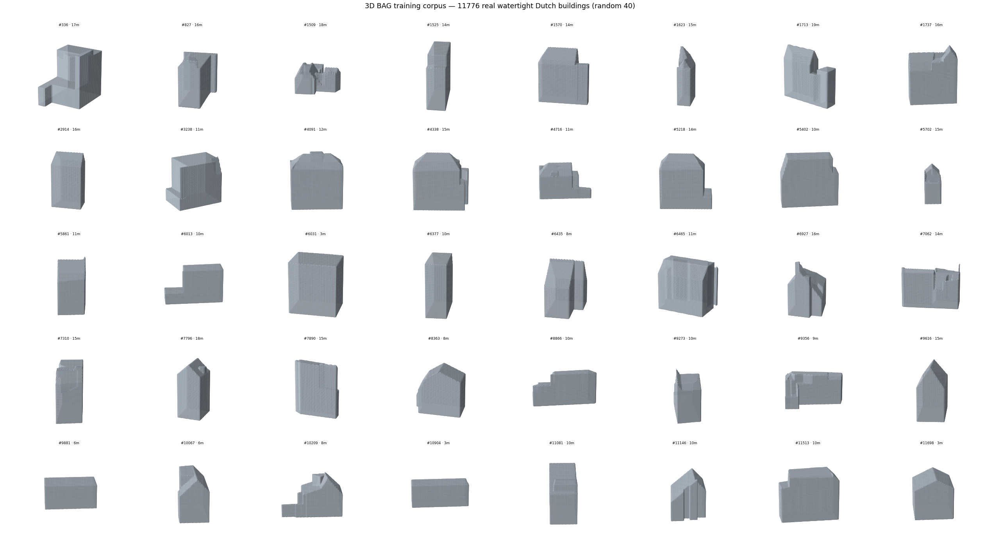
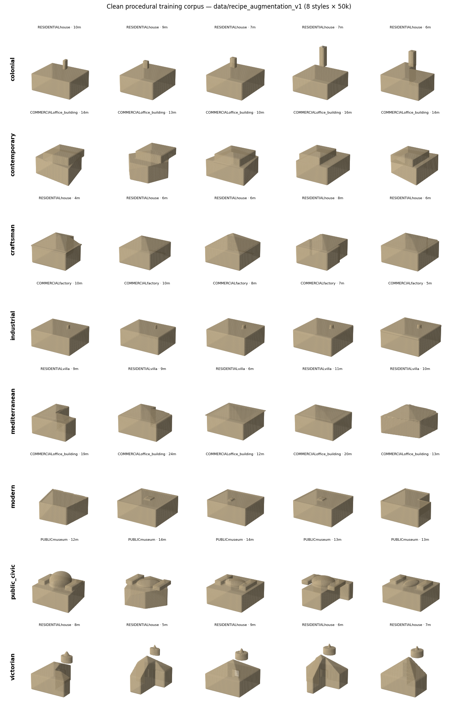
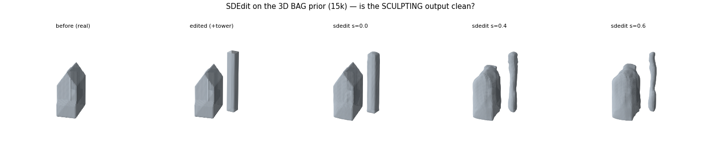
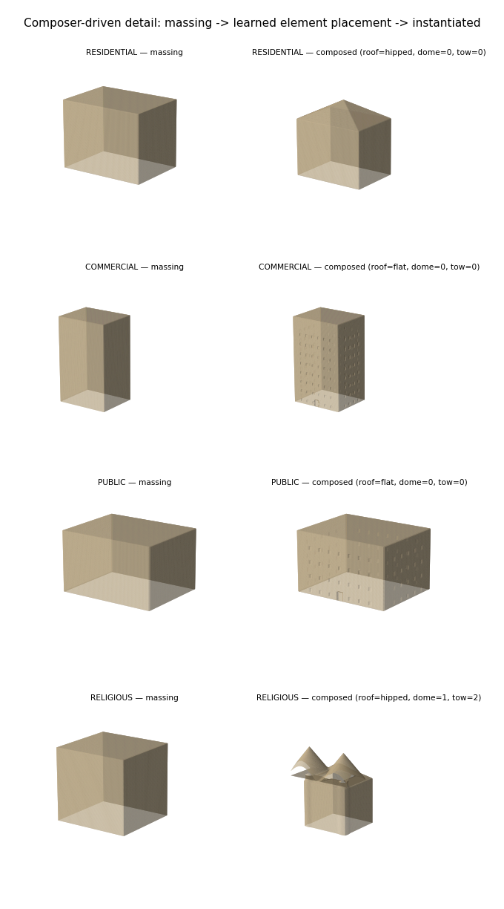
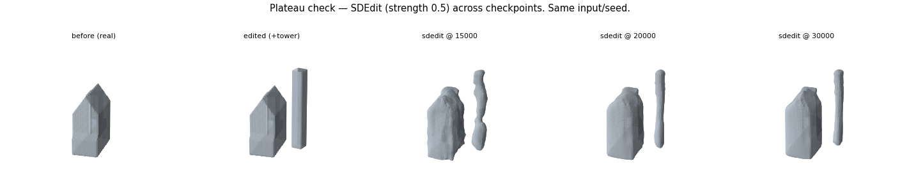

# Generative, Sculptable 3D Towns from Symbolic Input
### Progress report — June 2026
**Author:** Danvi Simhadri  ·  **Project:** GenerativeTowns / SDFusion

---

## 1. Goal and novelty

**Objective.** Turn a set of building footprints (from an OpenStreetMap tile or an uploaded
footprint image) into a navigable 3D town in which **each building is generated from purely
symbolic input** — `(footprint polygon, class, height, style)`, with *no* reference image —
and is **interactively sculptable**: the user edits a building and it *adapts* into a coherent
structure (in the spirit of real-time SDF tools such as Unbound, but with a learned model
supplying the "make it a plausible building" step those tools lack).

**Core thesis.** One can never enumerate every building in a dataset. So rather than scaling
data, we teach the model to **(i) transform** any rough input onto the manifold of plausible
buildings, and **(ii) compose** it from *understood architectural elements* (windows, doors,
roofs, towers). Generality then comes from transform + composition, not from data size.

---

## 2. System pipeline

```
 OSM tile / footprint image
        │  footprint extraction  (skimage / osmnx)
        ▼   per building: (footprint, class, height, style)
 ┌───────────────────────────────────────────────────────────────┐
 │ ① MASSING PRIOR  — VQVAE + conditional latent diffusion (SDF)  │
 │    sculpt = SDEdit: encode edit → partial-noise → denoise →    │
 │    a clean, coherent building SOLID                            │
 ├───────────────────────────────────────────────────────────────┤
 │ ② ELEMENT COMPOSITION — part-composer (learned on real labels)│
 │    decides glazing / roof / dome / towers / steps; sdf_detail  │
 │    instantiates windows, DOOR, roof, landmarks as solid SDF    │
 └───────────────────────────────────────────────────────────────┘
        │  marching cubes  ·  place  ·  compose
        ▼
 navigable 3D town  →  select a building → sculpt → ① re-snaps, ② re-details
```

The split is deliberate: **① supplies coherent *massing*** (the overall solid); **② supplies
the *building-ness*** (crisp, understood elements). A 64³ implicit prior is excellent at the
former and fundamentally limited at the latter, so element crispness is delegated to ②.

---

## 3. Method

### 3.1 Massing prior (①): latent diffusion + SDEdit
A VQVAE encodes a 64³ signed-distance field to a compact latent; a conditional diffusion model
(conditioned on footprint, class, height, style) is trained in that latent space. **Sculpting
uses SDEdit** (Meng et al., ICLR 2022): the user's crude edit is encoded, *partially* noised,
and denoised by the prior — the imposed coarse structure survives while the result snaps onto
the manifold of real buildings. A single `strength` knob trades faithfulness ↔ realism.

### 3.2 Element composition (②): part-composer + detail
A conditional diffusion **part-composer** is trained on **real BuildingNet part labels**
(window, wall, roof, dome, tower, stairs) to predict, from a building's massing, *which*
elements it should have and roughly where (glazing ratio, roof type, dome/tower/step
placement). A procedural detail module then **instantiates** these as solid, differentiable
SDF primitives (recessed window grids, a ground-floor door, gabled/hipped roofs, fused corner
towers, a roof-mounted dome).

---

## 4. Data

We train the massing prior on **real, watertight building geometry** rather than the
non-watertight BuildingNet meshes (whose signed field is a broken thin shell). Source: the
Netherlands **3D BAG** (open LoD2.2 city model). We query its API, extract per-building
watertight solids, and voxelize to 64³ signed SDFs via a robust (generalized-winding-number)
sign — **11,776 buildings**.


**Figure 1.** Sample of the real 3D BAG training corpus (40 of 11,776). Real gabled/hipped
roofs, L-shapes, set-backs, and tower forms — watertight by construction.


**Figure 2.** For contrast, our earlier *procedural* corpus (8 styles). Clean but boxy and
low-variety — which motivated moving to the real 3D BAG massing above.

---

## 5. Results


**Figure 3. Sculpting works.** Left→right: a real building; a *crude* user edit (a tower spike
attached); SDEdit output at increasing `strength`. The output is a **clean, coherent solid**
— not the speckle that pure generation-from-noise produces — confirming that the editing
regime is the right one to deploy.


**Figure 4. Learned element placement.** A boxy massing per class (left) → the part-composer
chooses class-appropriate elements and `sdf_detail` instantiates them (right). The composer
reproduces real per-class composition learned from BuildingNet — e.g. **religious buildings
receive a dome + towers**, residential receive pitched roofs, commercial/public flat roofs.


**Figure 5. Training convergence.** SDEdit output for the same input across checkpoints
(15k / 20k / 30k). Massing quality improves quickly then largely plateaus — additional
training yields diminishing returns; expressiveness instead comes from composition (②) and
corpus breadth.

---

## 6. Key findings

1. **The editing regime beats from-scratch generation.** Unconditional generation from pure
   noise is degenerate (a known metric-vs-inference gap), but **SDEdit at partial noise yields
   clean buildings** — so we never sample from noise; we always sculpt/transform.
2. **Massing converges fast; data *breadth* and *composition* are the real levers**, not more
   iterations (Figure 5).
3. **Part-level coherence requires a part-aware model.** Additive (union) composition can place
   elements but cannot guarantee they *attach, don't duplicate, and replace prior geometry*.
   We implemented deterministic coherence rules as a stop-gap, and have specified a learned
   **part-proxy + global-mixing** model (à la SPAGHETTI/SALAD/SPLICE) as the principled fix.

---

## 7. Status and next steps

| Component | Status |
|---|---|
| ① SDEdit massing prior (3D BAG) | trained; sculpt output validated clean |
| Real watertight corpus (3D BAG, 11,776) | built |
| ② part-composer → detail (incl. door) | built and wired into the engine |
| Part coherence — deterministic rules | done |
| Part coherence — learned part-mixing | designed (next) |
| Full OSM → town → in-browser sculpt loop | partially built (web demo); final wiring next |

**Next:** (a) route the SDEdit massing + composer through the interactive web sculpt UI to
close the OSM→town→sculpt loop; (b) build the learned part-mixing model so element edits
re-cohere automatically.

---

## 8. Selected references
- Cheng et al., **SDFusion** (CVPR 2023) — SDF latent diffusion (foundation).
- Meng et al., **SDEdit** (ICLR 2022) — guided synthesis/editing via partial-noise diffusion.
- Hertz et al., **SPAGHETTI** (SIGGRAPH 2022); Koo et al., **SALAD** (ICCV 2023) — part-level
  implicit editing / mixing.
- **SPLICE** (2025, arXiv:2512.04514) — part-level editing with global neural mixing.
- Mo et al., **StructureNet** (SIGGRAPH Asia 2019) — part-graph structure-aware generation.
- **3D BAG** (TU Delft) — open LoD2.2 building models; **BuildingNet** — part labels.
- Quilez — analytic SDF primitives; libigl — generalized-winding-number sign.
