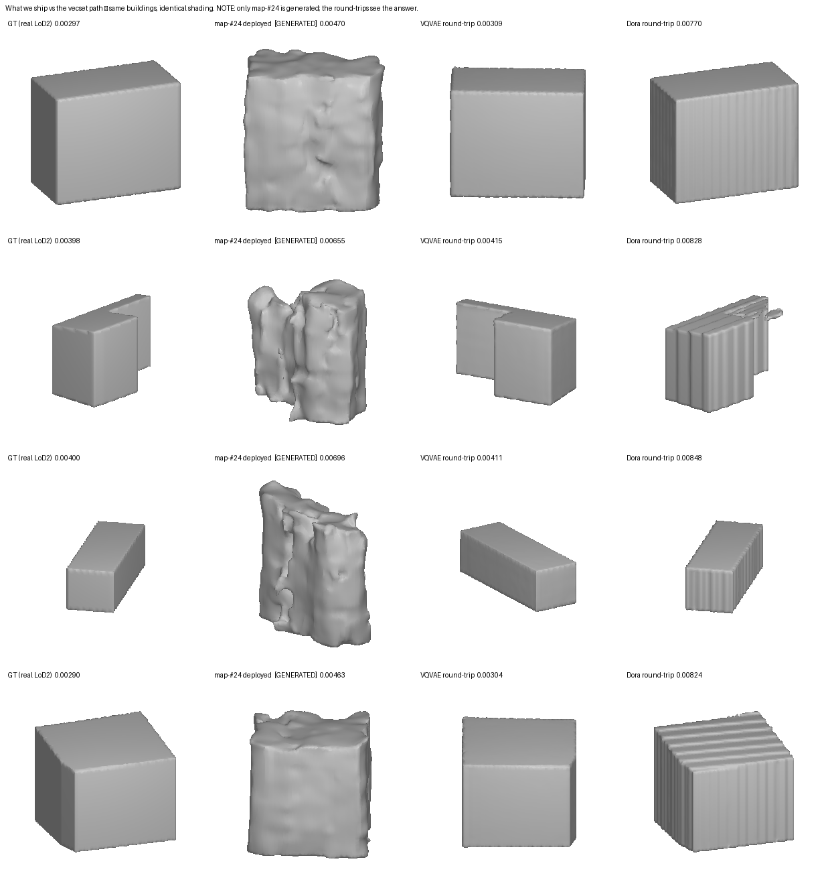

# What we ship vs the vecset path — and the metric fails

**Date:** 2026-07-28 · same held-out buildings, all arms meshed at level 0.0 and shaded identically.

| arm | roughness | what it actually looks like |
|---|---|---|
| **GT** (real LoD2) | **0.00346** | clean crisp boxes |
| **map-#24 deployed** *(GENERATED)* | **0.00571** | **melted, lumpy — barely a building** |
| **VQVAE round-trip** | **0.00360** | **near-perfect, indistinguishable from GT** |
| **Dora round-trip** | **0.00818** | correct shape, crisp edges, ribbed faces |

## The headline: the metric is anti-correlated with the goal here

**`surface_roughness` ranks the melted blob (0.00571) as BETTER than the crisp ribbed box (0.00818).**
Look at the figure: rows 2 and 3 show map-#24 turning an L-plan and a simple box into unrecognisable
organic masses, while Dora returns a recognisable building with sharp edges and a fine surface texture.
Any human asked "which is a building?" answers instantly, and the metric says the opposite.

This is the sharpest possible confirmation of what [#36](https://github.com/danvisai/SDFusion/issues/36)
concluded and [#63](https://github.com/danvisai/SDFusion/issues/63) restated: **no scalar we have
separates crisp from rough, and the visual is the primary arbiter.** The metric penalises
high-frequency ripple heavily and low-frequency melting barely — and low-frequency melting is the
failure that actually destroys architecture.

**Consequence: the frozen gate's verdict should not be read as "Dora is worse than what we ship."** On
the number, yes. On the thing we are trying to achieve, plainly no.

## The second finding: our codec is excellent, and Dora's is a downgrade

**VQVAE round-trip 0.00360 against GT 0.00346** — visually indistinguishable. This confirms
[#56](https://github.com/danvisai/SDFusion/issues/56) emphatically and *visually* for the first time:
our dense-grid codec is essentially perfect on our data.

It also surfaces a real cost that #64/#65 did not anticipate: **as a pure autoencoder, our existing
VQVAE beats Dora on our data (0.0036 vs 0.0082).** Adopting a vecset codec is a *reconstruction
downgrade*. That is not fatal to A2, but it was not priced in.

## What the comparison does and does not decide

⚠️ **Asymmetric by construction:** map-#24 *generates* from a footprint alone; both round-trip arms are
handed the ground-truth surface. This favours the round-trips and is not a like-for-like generative
comparison.

What it isolates cleanly is **how much each stack's generator loses against its own codec ceiling**:

| stack | codec ceiling | generator delivers | lost |
|---|---|---|---|
| **dense grid (today)** | 0.00360 | 0.00571 | **0.0021, and visually catastrophic** |
| **vecset (proposed)** | 0.00818 | *unknown — not built* | *the entire A2 bet* |

The A2 thesis was never "Dora's codec is better". It is that **a token-set latent is easier for a
diffusion to model than a dense grid**, so its generator should lose less of its ceiling. This figure
sharpens that bet but does not settle it: nobody has trained a token-set diffusion on our corpus.

If a token diffusion loses proportionally as much as the dense-grid one, A2 lands ~0.010 and looks
worse on the metric — but possibly *better* to the eye, since Dora's failure mode is ripple rather than
melt. If it loses less, A2 wins on both.

## Recommendation

1. **Stop treating `surface_roughness` as the arbiter for this decision.** It is demonstrably
   anti-correlated with the goal on exactly the comparison that matters. Use it as a regression guard
   only; judge on montages, and prefer resolution-independent surface metrics (normal consistency,
   Chamfer) where a scalar is needed.
2. **Price in the codec downgrade.** A2 inherits a decoder that reconstructs our buildings *worse* than
   the one we already have. The bet rests entirely on the diffusion side of the ledger.
3. **The cheapest decisive next experiment is a small token-set diffusion on our corpus** — not a full
   campaign, enough to measure how much of Dora's ceiling a generator retains. That is the one number
   nobody has, and it is what the whole A2 decision turns on.
