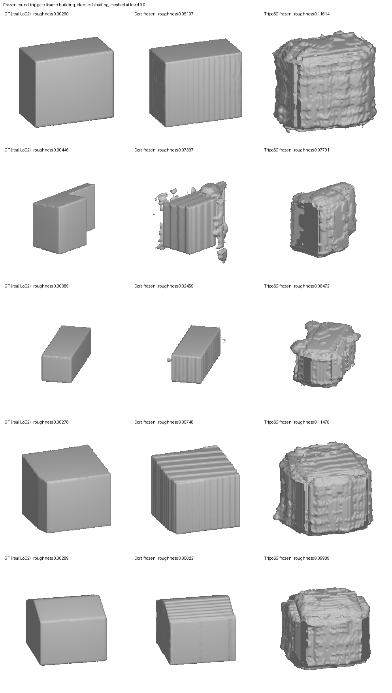

# The frozen round-trip gate — NEGATIVE

**Date:** 2026-07-28 · **n=24 held-out, stratified NL/DE/JP, real LoD2 surfaces (#62).**

**Verdict: the frozen vecset codec does not preserve our surfaces.** It is 2.4× rougher than ground
truth, worse than the model we currently ship, and worse than the wall that stopped every previous
attempt. A fine-tune is not an optimisation here — it is load-bearing.

## Result

| arm | roughness | |
|---|---|---|
| **GT** (stored field) | **0.00404** | the floor |
| **input surface** — CONTROL, codec not involved | **0.00404** | identical to GT |
| **FROZEN codec** | **0.00984** | the measurement |
| *refiner / corrector wall* | *0.00470* | reference |
| *map-#24 deployed* | *0.00552* | what we ship |

**Codec contribution = frozen − input = +0.00580.**

Occupancy tracks closely throughout (e.g. 0.214 → 0.215, 0.108 → 0.106), so the **shape** survives the
round-trip. What degrades is **surface fidelity** — exactly the quantity this effort exists to fix.

## The control arm is what makes this trustworthy

`input` came out **exactly equal to GT (0.00404)**. The recovered surfaces are perfect — as #62's
alignment check independently established — so the input contributes nothing to the degradation. Every
bit of the +0.00580 is the codec.

Without that arm this number would be unreadable, which is precisely the mistake the earlier smoke made.

## Correction: the earlier smoke was not meaningfully confounded

The n=1 smoke scored **0.00839** on a mesh extracted from our own 64³ field, and I attributed that to the
degraded input, expecting real surfaces to fix it. **That was wrong.** With perfect input surfaces the
result is **0.00984** — if anything slightly *worse*. The confound was real but immaterial; the codec was
always the cause. Recorded so the earlier reasoning is not trusted downstream.

## What this does and does not say

**Does not contradict [#63](https://github.com/danvisai/SDFusion/issues/63).** That measured a
*generation* pipeline — a frontier model producing an idealised building from an image, scoring 0.00328.
This measures *reconstruction fidelity* of a specific frozen codec on our own geometry. A vecset decoder
can evidently **produce** crisp surfaces; this particular frozen codec does not **preserve** ours.
Different quantities, both true.

**Does say** the domain gap #64 predicted is real and large. Dora was trained on ~400,000 Objaverse
meshes; LoD2 massing is a different world.

## Both caveats now resolved — it is the codec, twice over

### The sampler is not the cause (ablation, n=9, identical buildings)

| sampler config | frozen | vs GT 0.00388 |
|---|---|---|
| baseline coarse 8192 / sharp 8192 | 0.00903 | 2.3x |
| fewer sharp 8192 / 2048 | 0.00906 | 2.3x |
| **small both 2048 / 2048** | **0.00848** | 2.2x (best) |
| dense coarse 16384 / 4096 | 0.01013 | 2.6x (worst) |
| **no sharp stream** (uniform x2) | 0.00970 | 2.5x |

Total spread ~+-8% around 0.0093, against a gap that needs closing by ~60%. **No sampling choice comes
close.** Two incidental findings: removing the sharp stream makes it *worse*, so sharp-edge sampling is
genuinely helping (just not enough); and *more* points is worse, consistent with FPS selecting from a
denser pool of a trivially simple shape.

### A second, independent codec is worse (TripoSG, n=24, same buildings)

| codec | frozen | codec contribution |
|---|---|---|
| **Dora-VAE** (Apache-2.0, TSDF) | **0.00984** | **+0.00580** |
| **TripoSG VAE** (MIT, SDF) | **0.01338** | **+0.00934** |

TripoSG's sign convention is the opposite of Dora's — it is already negative-inside — determined
empirically from occupancy agreement rather than assumed. Getting it wrong inverts the shape and shows
as occupancy jumping to ~0.85, which is how the first TripoSG run failed.

**Dora remains the better base**, so [#65](https://github.com/danvisai/SDFusion/issues/65)'s choice
stands. But two independent frozen codecs across five sampler configurations all land **2.2–3.3x GT** and
all lose to the deployed dense-grid model. The finding is robust.

## What the surfaces actually look like



The scalars understated this badly. **The failure mode is periodic corrugation on flat faces** —
Dora's output is ribbed like corrugated metal across every facade, keeping the overall block shape but
destroying exactly the flatness that defines LoD2 massing. TripoSG degrades further, into blobby
cratered surfaces barely readable as buildings.

**This is the artifact class [#63](https://github.com/danvisai/SDFusion/issues/63) warned the metric is
blind to.** #63 recorded fine-scale striation on flat faces as something `surface_roughness` does not
detect, and flagged the scalar as necessary-but-not-sufficient. That caveat has now proved decisive:
striation is not an incidental artifact of these codecs, it is their *characteristic* failure on our
domain, and judging by roughness alone would have understated it.

The ribbing looks **periodic and aliased**, which points at a concrete mechanism: the decoder's
frequency positional embedding (8 frequencies) producing standing waves across large flat regions. That
is consistent with models fit to organic, detail-dense geometry being asked to reconstruct big planar
facades.

⚠️ **Note on the montage's numbers:** the labels there are roughness of the **raw decoded field**, which
for these codecs is a normalised TSDF or logits with much steeper gradients — hence values ~0.05–0.12.
The gate's **0.00984 / 0.01338** are the comparable figures, measured after re-voxelising to metric
distance. The ranking is identical; only the scale differs.

## Why this might be happening

Offered as hypothesis, not measurement. Our massing is **near-prismatic and extremely simple** — often
~12 vertices, large flat faces, hard edges. Both codecs were trained on open-domain organic/complex
geometry, and both compress into a **fixed 2,048-token latent** regardless of how simple the shape is.
A cross-attention decoder over frequency-embedded queries, fit to complex surfaces, appears to smooth
exactly the large flat faces our domain is made of. If so this is out-of-distribution in the *unusual*
direction, and a fine-tune on our corpus is precisely the right remedy — but it must close a large gap,
not polish a small one.

## Superseded caveat (kept for the record)

Our buildings are **extremely simple** — often ~12 vertices, essentially a box with a roof. Dora expects
complex Objaverse geometry, so this is out-of-distribution in the *unusual* direction: trivially simple
rather than trivially complex. Two consequences worth testing before concluding the codec is at fault:

1. **The sampler may be mis-tuned for this regime.** We feed 8,192 uniform + 8,192 sharp-edge samples.
   On a 12-edge box that is heavy oversampling of edges, and Dora's own preprocessing uses different
   stream ratios on watertight meshes prepared its own way.
2. **The latent is wildly over-provisioned** — 2,048 tokens for a box — so the posterior may be
   contributing noise where there is almost no geometry to describe.

**Recommendation: run a cheap sampling/latent ablation before committing to a fine-tune.** If a
meaningful part of the +0.00580 is our sampling rather than the codec, a fine-tune would be training
against our own artifact. This is hours of work against a multi-week campaign, and it is the same
cheapest-first discipline that produced every useful result in this effort.

The alternative arm, **TripoSG (MIT, SDF-native)**, is already named as the fallback in
[#65](https://github.com/danvisai/SDFusion/issues/65) and is worth measuring in the same harness — the
gate is now a one-command comparison for any codec satisfying the contract.

## Status against spec [#68](https://github.com/danvisai/SDFusion/issues/68)

The gate was the spec's deliverable and it has been delivered — with a negative answer, which is a
result rather than a failure. It sized the fine-tune, and the size is **large**. Nothing in
[#67](https://github.com/danvisai/SDFusion/issues/67) is invalidated: A2's later stages were always
gated on this number. They are now gated on it saying "adaptation is required."

## Reproduce

```
sdfusion/bin/python scripts/foundations/dora_frozen_gate.py --n 24
```

Artifact: `outputs/dora_frozen_gate/gate.json` (per-building rows, aggregate, codec delta).
