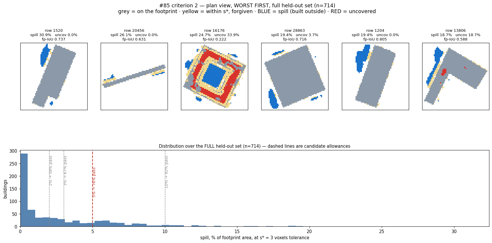

# Criterion 2, restated: spill and uncovered, at the detail scale

Ticket: [Restate criterion 2, or accept a gate the method cannot reach](https://github.com/danvisai/SDFusion/issues/85)
· Map: [#69](https://github.com/danvisai/SDFusion/issues/69) · 2026-08-07

## The criterion

> **Criterion 2 — footprint fidelity.** Does the generated **massing** stay on the supplied footprint?
>
> Footprint error is split three ways and **never quoted as one number**:
>
> * **fringe** — disagreement within **s\*** of the footprint boundary. **Reported and ignored.**
> * **spill** — massing built outside the footprint. **Counts.**
> * **uncovered** — footprint left unfilled. **Counts.**
>
> **Tolerance:** s\* = **3 voxels @64³** (ADR 0004, 1.0 m).
> **Gate:** spill ≤ **5%** and uncovered ≤ **5%** of footprint area.
> **Judged by:** the human, on the **worst-first plan view**. No scalar overrides this.

**Status at the gate: 76.5% of held-out buildings pass** (n=714, 95% CI [73.4%, 79.6%]).

## Why the old form was wrong

The old criterion demanded **fp-IoU 1.000**, and the map reported A2 at 0.962 as "the live gap".

Two errors, both mine, both in the ticket that opened this:

⚠️ **"Part of the 0.003 is marching-cubes discretisation."** False. `fp_iou` is computed from the 64³
occupancy (`field <= 0`, projected down the H axis). Marching cubes is not in that path at all. #71's
ribbing finding is about the *render*, not this criterion.

⚠️ **"0.997 is a hard cap."** False. The codec ceiling is a *distribution* with a tail to 0.7639, and
**A2 exceeds it on 6 of 48 buildings** — it caps faithful *reconstruction of GT*, while criterion 2
scores against the *conditioning footprint*, a different target a conditioned generator can hit exactly.

The real problem was different, and the human found it: **the number disagreed with what the render
showed.** Measured, that is because fp-IoU conflates two unlike things, and their ratio swings from
**21% to 100%** building to building. At the median, **76% of the "error" is a half-voxel boundary
rounding** — invisible, and present even when the model is right.

## Why s\* is not a tuning knob

The tolerance is **not** a number chosen to make a result pass. `CONTEXT.md` fixes the **detail scale
s\*** at 1.0 m ≈ 3 voxels @64³ by **ADR 0004, decided in advance**, as the line between **massing** and
**detail**. Criterion 2 is a massing claim, and detail is out of this map's scope.

The **allowance** (5%) *is* a choice, and it is recorded as one — in `C2_ALLOWANCE` and in a test, so it
cannot drift silently. 10% was measured (92.3%) and rejected: a 10% plan-area error is a visible fault,
not an approximation.

⚠️ **The strict figures stay on the record**: 0% allowance → **23.8%**; 1-voxel tolerance → 19%; zero
tolerance → 4%. This map has moved a goalpost before, so the softer number never appears alone.

## What the split shows

Full held-out set (n=714), A2 at s=0.5:

| component | median | mean | p90 |
|---|---|---|---|
| fringe *(ignored)* | 0.0251 | — | — |
| **spill** | **0.0105** | **0.0282** | 0.0779 |
| uncovered | **0.0000** | — | 0.0000 |

🔑 **Uncovered is essentially zero. Spill is the entire failure.** The model almost never fails to fill
the footprint; it builds outside it. That is the *same defect* criterion 3 reports as `extra` — one
problem, seen once in plan and once in volume.

They stay **separate numbers** (spill can be zero while `extra` is large, when the model builds too high
but stays inside the plan — exactly the distinction a footprint-conditioned generator should be judged
on), but the map now states the link so nobody counts them as two independent faults again.

## The instrument

`build_plan_view()` — straight down, **worst first**, on every scored run.

⚠️ **Worst-first is not presentation, it is the point.** At the median the footprint is essentially
exact. A median-ish sample would pass criterion 2 by construction. The tail is where the real failures
live — and two of them were invisible until the sample stopped being Dutch-only:

- **filled courtyards** — row 16176, a ring footprint built solid, fp-IoU 0.222
- **detached masses** built clear of the plan — rows 1520, 1204, 28863

Both are **low-solidity footprints**, the same predictor [#84](https://github.com/danvisai/SDFusion/issues/84)
identified for the hollow collapse.

## Shipped

`scripts/foundations/eval_massing_arms.py` — `footprint_split()`, `criterion2_report()`,
`build_plan_view()`, `--plan N`. Artifact carries `criterion2.allowance` and the full pass-rate curve
with intervals, not just the gate.

**22 contract tests green**, including: an exact footprint scores zero everywhere; a 1-voxel overshoot is
fringe and **never** spill; a detached mass is spill; a filled courtyard is spill while an eaten one is
uncovered; `tol=0` turns every fringe pixel into spill; and both s\* and the allowance are pinned so a
future change has to be deliberate.
