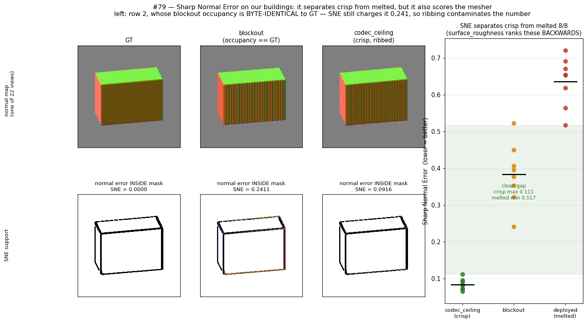

# Sharp Normal Error: the search for a scalar arbiter is over — with a caveat

Ticket: [Validate Sharp Normal Error on our buildings, and put it in the harness](https://github.com/danvisai/SDFusion/issues/79)
· Map: [#69](https://github.com/danvisai/SDFusion/issues/69) · 2026-08-07 · A100

**Verdict: ADOPT as a reported diagnostic.** SNE is the **first scalar in this project that ranks crisp
above melted.** It is *not* promoted to an arbiter — criterion 1 stays visual — and it carries a
measured contamination that must be quoted with it.

## The result

n=8 on the fixed held-out ids, 22 views, Canny σ=2.0, dilate 3×3.

| arm | SNE (mean) | median | per-building range |
|---|---|---|---|
| gt | **0.0000** | 0.0000 | — |
| **codec_ceiling** (crisp, ribbed) | **0.0841** | 0.0823 | 0.065 – 0.111 |
| blockout | 0.3833 | 0.3865 | 0.241 – 0.523 |
| **deployed_map24** (melted blob) | **0.6358** | 0.6534 | 0.517 – 0.720 |

## C1 — the known-answer pair: **PASS, cleanly**

The ticket named the one pair whose answer we already know. `surface_roughness` ranks the **melted blob
(0.00571) above the crisp ribbed box (0.00818)** — backwards, and that inversion is why #36, #63 and
`deployed-vs-dora` all concluded no scalar separates crisp from melted.

**SNE gets it right by 7.6×**, and the separation is total: **crisp max 0.111 < melted min 0.517**, so
all 8 buildings are ordered correctly with no overlap. This is the thing three previous instruments
failed to do.

### Why masking rescues it — the mechanism, not just the number

Look at the top row of the figure. `codec_ceiling`'s normal map is **heavily ribbed**, yet it scores
0.084. The reason is in the bottom row: **the salient mask is a thin edge outline covering ~6% of
pixels**, and the ribs live on the flat **faces**. Face ribbing barely enters the average.

That is the whole difference from `surface_roughness`, which is a raw |Laplacian| over the entire
surface and therefore drowns in exactly the artifact that is not the failure being measured.

## C2 — the ribbing control: **FAIL, but it does not invert the ranking**

The ticket demanded this check explicitly: *"An instrument that scores the ribs as roughness is
measuring the renderer, not the model — check this explicitly."*

Row 2's blockout has occupancy **byte-identical to GT** — `(bo<=0) == (g<=0)` everywhere, the same
building voxel for voxel. A metric that measures geometry must return ~0.

**It returns 0.2411.**

So SNE *is* partly scoring the mesher. A faceted signed EDT does not only rib the faces; it perturbs
the **edges**, which is precisely where the mask lives. Visible in the figure's middle bottom panel —
the error concentrates on the silhouette and the vertical edge.

⚠️ **The offset is not a constant that can be subtracted.** The codec's own ribbing contaminates far
less (0.084) than the EDT's (0.241), because the two fields are faceted differently. So there is no
correction factor, only a floor below which cross-arm gaps are unreadable.

**But it does not overturn C1**: 0.241 sits well below the melted arm's 0.517 minimum, so the
crisp/melted verdict survives its own contamination with room to spare.

## C3 — do coarse meshes have salient regions? **PASS**

[The corpus audit](https://github.com/danvisai/SDFusion/issues/74) found the corpus extremely coarse —
median 20 faces, plateau median 12 (a cube) — and warned SNE might have nothing to mask onto.

Measured coverage: **6.0% of pixels** (min 4.8%, max 7.3%). A box has a silhouette and three visible
edges, and Canny finds them. Coarseness is not the blocker.

## What went into the harness

`scripts/foundations/eval_massing_arms.py::sharp_normal_error`, reported under `--sne` (default 22
views, `0` disables), computed on the **montage subset** rather than all ids — it costs
`views × arms × buildings` rasterisations. Written to the artifact under `sharp_normal_error`.

Harness integration reproduces the standalone probe exactly: gt 0.0000 · blockout 0.3833 ·
codec_ceiling 0.0841.

**Contract test added** (`test_eval_massing_arms.py`, 13/13 green): identical geometry must score 0,
and a melted surface must score **worse** than an identical one. The ordering is pinned in a test
rather than left in prose, because that ordering is the only reason this metric is in the repo.

## How to read it, and how not to

- ✅ **Within one arm across runs** — safe, like roughness.
- ✅ **Across arms when the gap is large** — the crisp/melted 7.6× dwarfs the 0.241 contamination.
- ❌ **Across arms for small gaps** — a difference under ~0.24 between arms with different field
  representations is not readable.
- ❌ **As an arbiter.** Criterion 1 is visual and stays visual. SNE is reported beside the montage, not
  in place of it.

## What this closes

The map recorded *"three scalars have now failed to separate crisp from melted"* and #79 was filed to
end the ambiguity either way. **The answer is that a scalar does exist**, its name is SNE, and its
mechanism is masking to salient regions rather than averaging over the surface. The instrument is
imperfect and its imperfection is quantified above.
