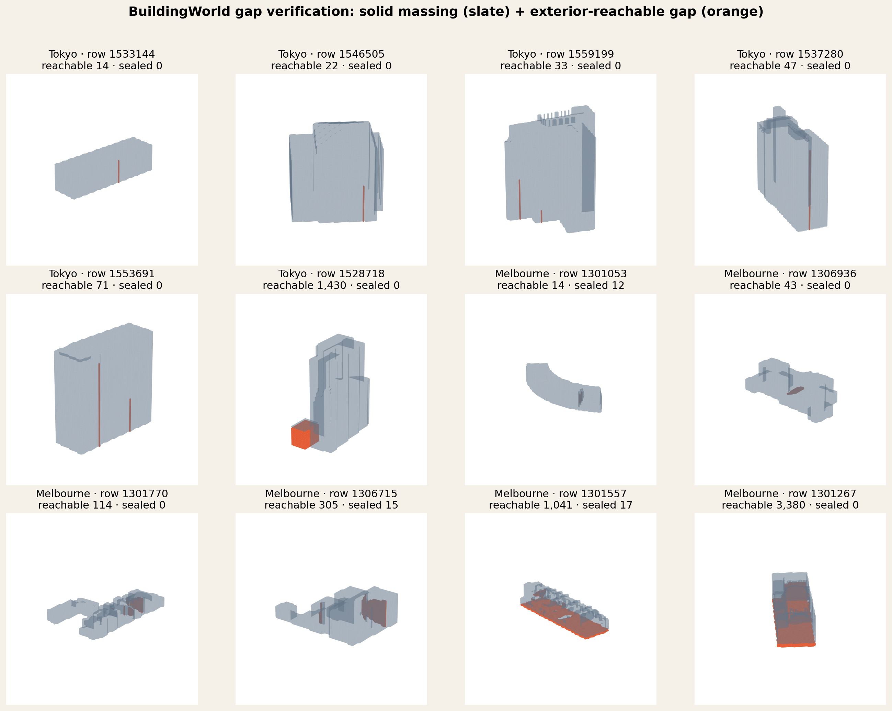
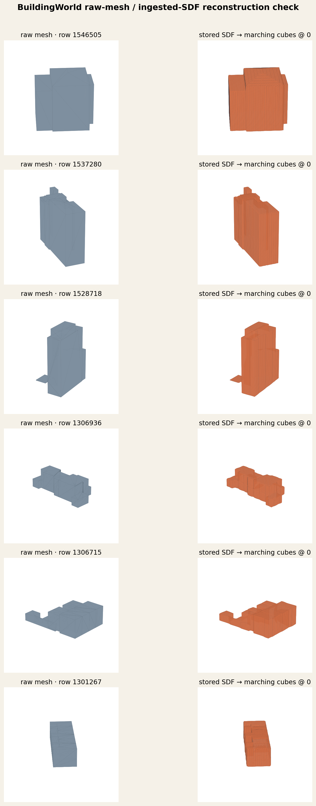

# BuildingWorld void/passage reachability verification

*2026-09-17. CPU/read-only verification for the whole-volume voxel transform (map
[#113](https://github.com/danvisai/SDFusion/issues/113)). This follows up section 2.3 of the
Firstmate research report at `data/sdfusion-voxel-research/report.md`. No A2/Dora checkpoint was
loaded, no GPU was used, and no corpus file was changed.*

## Decision

**The BuildingWorld gap signal is confirmed as predominantly exterior-reachable, admissible
non-height-field structure, not sealed defect cavities.** The whole-volume effort should therefore
proceed against the new BuildingWorld corpus rather than treat the frozen pre-BuildingWorld
384/96/714 manifest as its experimental population.

This is an operational geometry result, not a semantic annotation result. Reachability establishes
that an empty region is open to the exterior and therefore admissible under the project's validity
contract; it does not by itself name the region `courtyard`, `passage`, `light_well`, `overhang`, or
`recess`. The montage shows both narrow slots/recesses and large undercuts. A later semantic
vocabulary task may subtype them, but that is not needed to reject the old corpus-wide
"height field" assumption.

The frozen 714 remains a useful historical regression control. It is not the population from which
to infer whether whole-volume correction can learn voids/passages.

## What was checked

The report's one-off measurement marked a row when a footprint column contained an empty voxel
between the building's inferred base and that column's topmost solid voxel. That detects general
non-height-field structure, but cannot tell an exterior opening from a sealed cavity.

[`verify_buildingworld_voids.py`](../../../scripts/foundations/verify_buildingworld_voids.py) makes
the check reproducible and imports the already-implemented, already-tested
`hollow_shell_voxels()` from `prototype_voxel_editor.py` without changing it:

1. Read occupancy as `sdf <= 0` from the production `real.h5`, whose stored axes are
   `(D=z, H=up, W=x)`.
2. Infer the row's base as the first up-axis plane containing any solid voxel. The ingested corpus
   is centered per building, so grid plane 0 is not ground in this file.
3. Reproduce the report's below-roofline gap mask.
4. Run `hollow_shell_voxels(occ)` and split gap voxels into exterior-reachable versus sealed.
5. Render a 12-row occupancy/gap contact sheet and compare six raw meshes with marching cubes at
   level zero on the stored SDF.

One wording correction matters for reproducibility: `hollow_shell_voxels()`'s committed
`flood_fill_exterior()` uses **6-connected empty-space reachability** from all six boundary faces.
The same file uses 26-connectivity for *solid-component* validation. This result executes the
committed function as written; it does not substitute the research report's mistaken description
of the empty-space fill as 26-connected.

## Fixed cohorts and result

The two cohorts target the report's strongest and riskiest findings. Samples are uniform without
replacement from sorted global row IDs, independently seeded per cohort with seed 119. The JSON
artifact commits every sampled row, every gap-flagged row's counts/provenance, and a SHA-256 over
the sampled `(row ID, packed occupancy)` stream.

| cohort | population | fixed sample | report's coarse rate | reproduced gap rate | gap rows with exterior-reachable voxels | reachable share of all gap voxels | sealed-only gap rows |
|---|---:|---:|---:|---:|---:|---:|---:|
| Tokyo (99%+ watertight in the report's audit) | 33,315 | 1,500 | 737/1,500 = 49.1% | **725/1,500 = 48.3%** | **724/725 = 99.9%** | **217,486/217,498 = 99.994%** | 1/725 = 0.14% |
| Melbourne `non_boundary_defect` | 4,105 | 1,000 | 189/1,000 = 18.9% | **172/1,000 = 17.2%** | **137/172 = 79.7%** | **93,573/96,987 = 96.5%** | 35/172 = 20.3% |

The independent coarse rates land inside ordinary sampling variation around the report's values
(Tokyo 95% Wilson interval 45.8–50.9%; Melbourne 15.0–19.7%). More importantly, the reachability
split is decisive:

- Tokyo's result is not a sealed-cavity phenomenon. Only 12 of 217,498 gap voxels are sealed, and
  only one of 725 affected rows is sealed-only.
- Melbourne's provisionally accepted `non_boundary_defect` class does contain some real sealed
  cavities: 35 affected rows are sealed-only and 56 mix reachable and sealed gaps. That does not
  explain the cohort-level signal. Exterior-reachable structure accounts for 96.5% of its measured
  gap volume.
- Counting rows is conservative for Melbourne because a row with a small sealed pocket and a much
  larger exterior opening is classified `mixed`, not cleanly reachable-only.

The committed sample occupancy digests are:

| cohort | SHA-256 |
|---|---|
| Tokyo | `b9ffcbd7cdf15f23102c21f6cee11ee32e7df88def2c81d4feacac77bff9bb63` |
| Melbourne `non_boundary_defect` | `6b650f256abdf1081934e0cfeb75886c84c776a3e07b92f9edca50fee3486a0e` |

## Visual and reconstruction check

The contact sheet spans the 20th–95th percentiles of reachable-gap size within each cohort rather
than selecting only spectacular extremes. Slate is solid occupancy; orange is the portion of the
below-roofline gap connected to a volume boundary.



The raw-mesh/SDF comparison uses six of those rows, three per cohort. Marching cubes on the stored
SDF preserves each raw mesh's overall footprint, relative proportions, roof/step form, and
multi-part structure. None is empty, full, sign-inverted, or reduced to a disconnected noise cloud.
The R=64 reconstructions retain the same ribbing/stair-step texture previously documented by
[#166](../buildingworld-corpus/166-watertightness-standard-decision.md); that discretization is
visible but does not erase the openings or alter the conclusion of the reachability test.



The visual evidence also bounds the claim: many Tokyo examples are narrow exterior-connected slots
or recesses, while the larger examples include clear undercuts and multi-volume openings. This
check confirms admissible whole-volume structure. It does not claim every affected row is a
canonical courtyard or passage, nor that every such feature is larger than the fixed detail scale
`s*`.

## Consequence for #119/#120

The scope question is now settled:

- **Do not materialize the final #119 cache from the old manifest unchanged.** Its 384 train, 96
  screen, and 714 full rows all precede BuildingWorld and the report measured zero through-void
  voxels on the fixed 714. A result on that population cannot answer the captain's whole-volume
  void/passage question.
- Build the actual decision cohort from BuildingWorld, preserving fixed row identity, content
  digests, isolation, and outcome-blind selection. Stratify enough exterior-reachable rows into the
  cohort that the target capability cannot disappear inside the mostly height-field population.
- #120 may still exercise the cache/model plumbing first on the already-built cheap NL/DE/JP
  cohort. That is a de-risking/smoke stage against A2's known source distribution, not the settled
  learnability experiment and not evidence about void/passage generation.
- Keep the fixed 714 as a named legacy regression control and add roof-family stratification to its
  report. Do not overwrite or silently reinterpret it as the BuildingWorld decision set.

This changes only corpus scope and the evidence attached to it. It does not authorize the GPU
caching/training run, change #125's source checkpoint, or relax any isolation/gate requirement.

## Ticket recommendations to carry forward

These are the settled research recommendations requested by the captain. They are recorded here
so the issue comments and the next implementation agent have one evidence-backed source of truth.

| ticket | recommendation |
|---|---|
| [#117](https://github.com/danvisai/SDFusion/issues/117) | Adopt the implemented and tested `ground_connected_ok`, `hollow_shell_voxels`, `min_thickness_survival`, and `sanitize_footprint` contract as the formal validity decision. Keep the committed reachability semantics: exterior-connected structural openings are admissible; sealed empty cavities fail. |
| [#118](https://github.com/danvisai/SDFusion/issues/118) | Make human visual review (fixed-frame plan/facade/isometric/section montages) and Sharp Normal Error with nonzero views mandatory gate conditions, in addition to the quantitative gates already specified by #125. |
| [#120](https://github.com/danvisai/SDFusion/issues/120) | Use a 3-D UNet-style whole-volume receptive field, not a per-voxel-independent head. De-risk plumbing cheaply on the existing NL/DE/JP cohort first, but judge the void/passage question on a BuildingWorld-inclusive, reachability-aware cohort. |
| [#121](https://github.com/danvisai/SDFusion/issues/121) | Keep the fixed 714-building protocol unchanged as a legacy regression control and add roof-family stratification using the existing validated classifier. Do not substitute it for the BuildingWorld scope. |
| [#123](https://github.com/danvisai/SDFusion/issues/123) | If stochasticity is pursued after deterministic correction, use categorical/discrete diffusion directly on binary occupancy. Gate it on whether #120's deterministic arm exhibits a joint-void failure; interleave validity projection in denoising rather than assuming end-only projection is unbiased. |
| [#124](https://github.com/danvisai/SDFusion/issues/124) | Ratify #125's two seams: branch from the complete A2 decoded field immediately before meshing, and judge through the fixed-ID massing evaluator. The corpus-scope prerequisite is now explicitly settled by this verification. |
| [#122](https://github.com/danvisai/SDFusion/issues/122) | **Untouched.** Architecture ontology/vocabulary research remains a separate task as requested. |

## Reproduction

Production run (CPU only):

```bash
env -u LD_PRELOAD -u LD_LIBRARY_PATH ./sdfusion/bin/python \
  scripts/foundations/verify_buildingworld_voids.py \
  --real-h5 data/real_massing_v1/real.h5 \
  --mesh-root data/buildingworld_mesh \
  --out-dir docs/wayfinding/whole-volume-voxel-transform/119-buildingworld-void-verification \
  --seed 119 --tokyo-n 1500 --melbourne-n 1000
```

The production `real.h5` used here has 1,562,554 rows, matching
[`174-ingest-buildingworld.md`](../buildingworld-corpus/174-ingest-buildingworld.md). The output
artifact is
[`results.json`](119-buildingworld-void-verification/results.json). Synthetic controls for a solid
box, exterior-reachable passage, sealed cavity, and centered-frame base inference live in
[`test_verify_buildingworld_voids.py`](../../../scripts/foundations/test_verify_buildingworld_voids.py).
